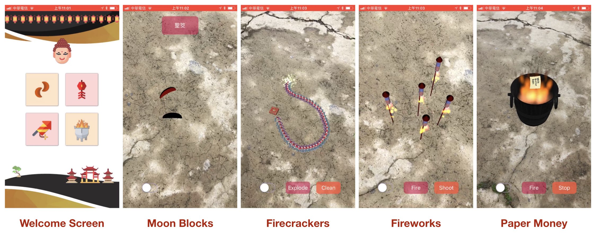

## Motivation
Traditional customs may cause environmental pollution and are disappearing gradually. We want to reserve these traditions in a virtual way (with AR) , which will not destroy the environment.

## Members
 - 林懷宇	
 - 洪軒治
 - 陳君豪

## Introduction

### Firecracker
1. Detect a horizontal plane
2. Touch the plane, and virtual firecrackers will appear.
3. Drag on the screen to determine the length of firecrackers
4. Click “Explode” button to Light firecrackers
5. firecrackers explode with sound and virtual explosion fire.

**Demo Video**

### Firework
1. Detect a horizontal plane
2. Touch the plane, and virtual firework will appear.
3. Click “Fire” button to light up the fireworks
4. Click “Shoot” button, then fireworks will shoot to the sky.
 
**Demo Video**

### MoonBlock
1. Detect a horizontal plane
2. Swipe on the screen, and the virtual moon blocks will be cast to the plane
3. After physical contact, show the result（笑筊, 聖筊, 陰筊, 立筊）
4. Demo Video
 
**Demo Video**

### PaperMoney
1. Detect a horizontal plane and virtual bucket will be append to the plane.
2. Throw virtual paper money into the bucket to keep the fire
3. After not throwing paper into bucket for a while, fire will slowly extinguish
 
**Demo Video**

